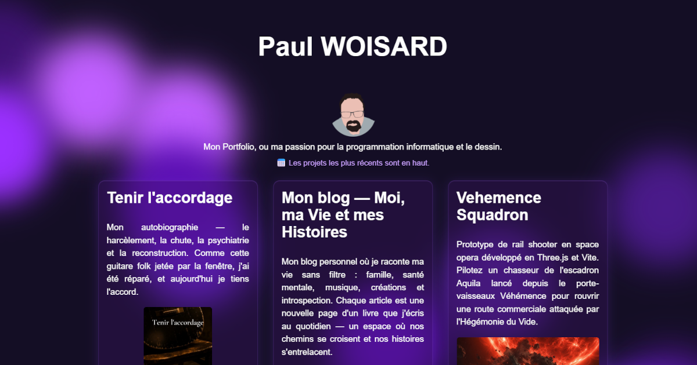

# Mon Portfolio

Site portfolio statique de Paul Woisard, disponible sur [paulwoisard.fr](https://paulwoisard.fr/).

Le projet présente une sélection de projets libres et open source, ainsi qu'une page CV imprimable.



## Structure

- `index.html` : page principale du portfolio.
- `assets/css/styles.css` : styles de la page principale.
- `cv/index.html` : page CV.
- `cv/styles.css` : styles du CV.
- `cv/print.css` : styles dédiés à l'impression du CV.
- `Dockerfile` et `nginx.conf` : configuration pour servir le site avec Nginx.
- `.htaccess` : configuration Apache pour la redirection HTTPS et le domaine canonique.

## Aperçu local

Avec Docker :

```powershell
docker build -t monportfolio .
docker run --rm -p 8080:80 monportfolio
```

Puis ouvrir [http://localhost:8080](http://localhost:8080).

Il est aussi possible d'utiliser n'importe quel serveur statique, par exemple VS Code Live Server ou `python -m http.server`.

## Déploiement

Le site peut être déployé de deux façons :

- via Docker/Nginx, avec le `Dockerfile` fourni ;
- via Apache, avec le fichier `.htaccess`.

Un workflow GitHub Actions construit et publie automatiquement l'image Docker multi-architecture sur Docker Hub lors des pushes sur `main` et lors des tags de version `v*.*.*`.

## Licence

Ce projet est distribué sous licence MIT. Voir [LICENSE.md](LICENSE.md).
